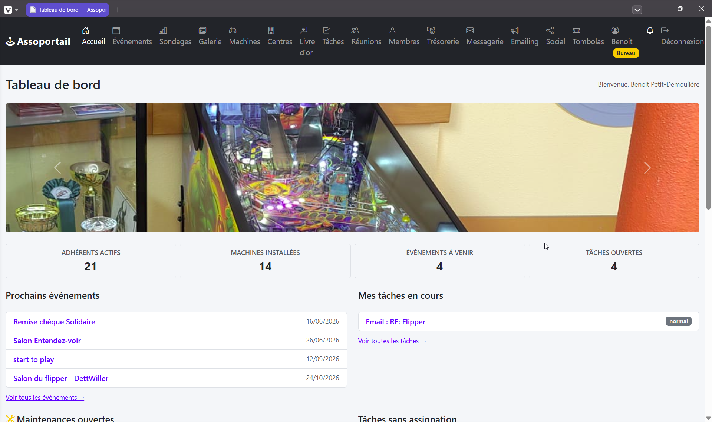
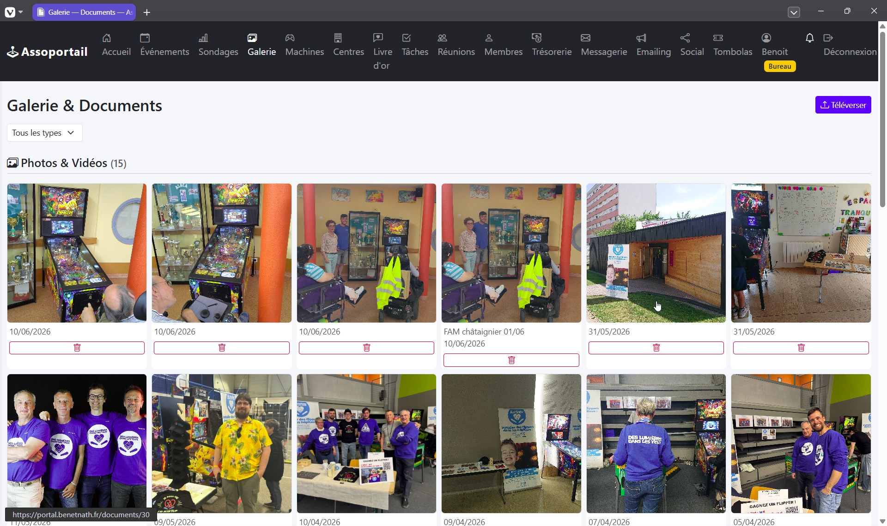
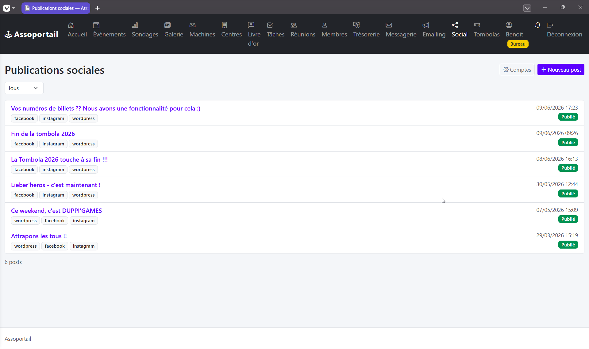

# assoportail

Portail de gestion associative complet, développé avec Flask. Conçu pour les associations qui souhaitent gérer leurs adhérents, événements, finances, bénévoles, parc matériel et communications externes depuis une seule interface auto-hébergée.

## Fonctionnalités

| Module | Description |
|--------|-------------|
| **Tableau de bord** | KPIs, fil d'activité, prochains événements, tâches ouvertes, alertes |
| **Adhérents** | Registre des membres, suivi bénévoles, import/export CSV, purge RGPD, attestations |
| **Événements** | Création, participants, créneaux, dépenses, justificatifs, réconciliation caisse |
| **Machines** | Inventaire matériel, suivi des installations par lieu, historique maintenance |
| **Centres** | Gestion des lieux partenaires, signalement pannes, formulaire de retour public |
| **Trésorerie** | Transactions, catégorisation des dépenses, reporting CERFA, config association |
| **Tâches** | Tableau de tâches, assignation, statut, sources liées aux événements et pannes |
| **Réunions** | Comptes rendus, ordres du jour, PV, création de tâches |
| **Mailing** | Campagnes email, sélection des destinataires, envoi cadencé (rate limiting) |
| **Boîte mail** | Intégration Gmail, règles de triage automatique, compteur non-lus |
| **Réseaux sociaux** | Publication Facebook, Instagram, LinkedIn, WordPress avec optimisation image |
| **Documents** | Galerie de fichiers, uploads (photos, vidéos, justificatifs) par entité |
| **Tombola** | Gestion de tombola, consultation de billets, uploads médias, tirage au sort |
| **Sondages** | Création de votes et enquêtes |
| **Notifications push** | Abonnements Web Push (PWA) et envoi |
| **Vitrine** | Page publique de présentation de l'association |
| **Authentification** | Connexion, 2FA (TOTP), réinitialisation mot de passe, gestion des comptes |

## Aperçu

| Tableau de bord | Galerie & Documents |
|:-:|:-:|
|  |  |

| Publications sociales |
|:-:|
|  |

## Stack technique

- **Python 3.13**, Flask 3.1, SQLAlchemy 2.0, Alembic
- **PostgreSQL 17**, Redis 7, Celery 5 (tâches asynchrones + scheduler)
- **Gunicorn** derrière Docker ; WeasyPrint pour la génération PDF
- **Bootstrap 5**, templates Jinja2, JS vanilla (compatible CSP, aucun handler inline)
- Tests : pytest + client de test Flask (PostgreSQL uniquement, pas de mocks)

## Prérequis

### Environnement d'exécution

- Docker et Docker Compose
- Un domaine avec HTTPS (Talisman impose HTTPS en production)

### Services externes

| Service | Usage | Configuration |
|---------|-------|---------------|
| **Google Workspace** | Intégration Gmail, stockage Google Drive | OAuth2 — déposer `credentials.json` via l'interface admin |
| **Meta** (Facebook / Instagram) | Publication réseaux sociaux | App ID + Secret Meta for Developers |
| **LinkedIn** | Publication réseaux sociaux | Client ID + Secret OAuth2 depuis LinkedIn Developer Portal |
| **Serveur SMTP** | Emails de création de compte et notifications | N'importe quel relay SMTP (mot de passe app Gmail, SendGrid…) |
| **Clés VAPID** | Notifications push PWA | À générer une fois avec `pywebpush` (voir ci-dessous) |

Tous les services externes sont optionnels — l'application fonctionne sans eux, les modules concernés deviennent simplement indisponibles.

## Démarrage rapide

### 1. Cloner et configurer

```bash
git clone https://github.com/Des-Lumieres-dans-Les-Yeux/Assoportail.git
cd assoportail
cp .env.example .env
```

Éditer `.env` — au minimum renseigner les secrets et les identifiants de base de données (voir [Variables d'environnement](#variables-denvironnement)).

### 2. Générer les clés VAPID (optionnel, pour les notifications push)

```bash
python -c "
from pywebpush import Vapid
v = Vapid()
v.generate_keys()
print('VAPID_PUBLIC_KEY =', v.public_key)
print('VAPID_PRIVATE_KEY_PEM =', v.private_key)
"
```

### 3. Démarrer les services

```bash
docker compose up -d
```

Le premier démarrage applique les migrations automatiquement. Le compte administrateur est créé à partir de `ADMIN_EMAIL` / `ADMIN_PASSWORD` dans `.env`.

### 4. Ouvrir l'application

Accéder à `http://localhost:${APP_PORT}` (port par défaut : `8000`).

## Variables d'environnement

Copier `.env.example` vers `.env` et renseigner les valeurs. Les champs obligatoires sont marqués **\***.

### Application principale

| Variable | Description | Défaut |
|----------|-------------|--------|
| `APP_CONFIG` | `prod` ou `dev` | `prod` |
| `SECRET_KEY` **\*** | Clé de signature des sessions Flask | — |
| `WTF_CSRF_SECRET_KEY` **\*** | Clé de signature des tokens CSRF | — |
| `TALISMAN_FORCE_HTTPS` | Redirection HTTP vers HTTPS | `true` |
| `WORDPRESS_URL` | Origine iframe autorisée pour la vitrine | — |

### Base de données

| Variable | Description |
|----------|-------------|
| `DATABASE_URL` **\*** | `postgresql://user:pass@db:5432/dbname` |
| `POSTGRES_USER` **\*** | Utilisateur PostgreSQL (Docker Compose) |
| `POSTGRES_PASSWORD` **\*** | Mot de passe PostgreSQL (Docker Compose) |
| `POSTGRES_DB` **\*** | Nom de la base de données (Docker Compose) |

### Redis / Celery

| Variable | Description |
|----------|-------------|
| `REDIS_URL` **\*** | `redis://:password@redis:6379/0` |
| `REDIS_PASSWORD` | Mot de passe AUTH Redis |

### Google OAuth2

| Variable | Description |
|----------|-------------|
| `GOOGLE_SHARED_DRIVE_ID` | ID du Drive partagé Google pour le stockage |
| `ENCRYPTION_KEYS` | Clés Fernet séparées par virgules pour le chiffrement des tokens OAuth |

### Uploads de fichiers

| Variable | Défaut |
|----------|--------|
| `UPLOAD_FOLDER` | `/data/uploads` |
| `MAX_UPLOAD_PHOTO` | `10485760` (10 Mo) |
| `MAX_UPLOAD_VIDEO` | `52428800` (50 Mo) |
| `MAX_UPLOAD_DOCUMENT` | `20971520` (20 Mo) |
| `MAX_UPLOAD_TOMBOLA_VIDEO` | `1073741824` (1 Go) |
| `MAX_CONTENT_LENGTH` | `1073741824` (1 Go — plafond du corps de requête) |

### SMTP

| Variable | Description |
|----------|-------------|
| `SMTP_HOST` | Nom d'hôte du serveur SMTP |
| `SMTP_PORT` | Port SMTP (ex. `587`) |
| `SMTP_USER` | Nom d'utilisateur SMTP |
| `SMTP_PASSWORD` | Mot de passe SMTP ou mot de passe d'application |
| `SMTP_FROM` | Adresse expéditeur |
| `SMTP_USE_TLS` | `true` / `false` |

### Réseaux sociaux

| Variable | Description |
|----------|-------------|
| `FACEBOOK_APP_ID` | App ID Meta |
| `FACEBOOK_APP_SECRET` | App Secret Meta |
| `LINKEDIN_CLIENT_ID` | Client ID OAuth2 LinkedIn |
| `LINKEDIN_CLIENT_SECRET` | Client Secret OAuth2 LinkedIn |
| `SOCIAL_IMAGE_QUALITY` | Qualité JPEG 1-95 (défaut : `85`) |
| `SOCIAL_MAX_IMAGES_PER_POST` | Nombre maximum d'images par publication |

### Mailing

| Variable | Description |
|----------|-------------|
| `MAILING_RATE_LIMIT` | Emails envoyés par minute |
| `MAILING_POLL_INTERVAL` | Intervalle de polling Celery (secondes) |

### Notifications push (VAPID)

| Variable | Description |
|----------|-------------|
| `VAPID_PUBLIC_KEY` | Clé publique VAPID (base64url) |
| `VAPID_PRIVATE_KEY_PEM` | Clé privée VAPID (format PEM) |
| `VAPID_CLAIMS_EMAIL` | Email de contact inclus dans les en-têtes push |

### Compte administrateur initial

| Variable | Description |
|----------|-------------|
| `ADMIN_EMAIL` **\*** | Adresse email du premier compte admin |
| `ADMIN_PASSWORD` **\*** | Mot de passe du premier compte admin |

## Développement

```bash
pip install -r requirements.txt
cp .env.example .env   # définir APP_CONFIG=dev, pointer vers PostgreSQL et Redis locaux
flask db upgrade
flask run
```

### Lint et tests

```bash
ruff check .
ruff format --check .
pytest
```

La suite de tests utilise une vraie base PostgreSQL. Définir `TEST_DATABASE_URL` dans `.env` si elle diffère de `DATABASE_URL`.

### Conventions de code

- Code Python en anglais, chaînes d'interface en français
- Annotations de type obligatoires sur toutes les signatures de fonctions
- Pas de JS inline dans les templates (CSP : utiliser les attributs `data-*` gérés dans `app/static/js/app.js`)
- Ruff lint + format imposés en CI

## Structure du projet

```
app/
  blueprints/        # Un sous-paquet par module fonctionnel (17 au total)
  models/            # Modèles ORM SQLAlchemy
  services/          # Logique métier (import/export CSV, géocodage, mailing, push…)
  static/            # JS, CSS, images
  templates/         # Templates Jinja2 (base.html + par blueprint)
  extensions.py      # Extensions Flask (db, login, csrf, limiter, celery…)
  __init__.py        # Application factory
migrations/
  versions/          # 31 fichiers de migration Alembic
tests/
  unit/
  integration/
docker-compose.yml   # 5 services : app, worker, beat, db, redis
```

## Licence

[GNU Affero General Public License v3.0](LICENSE)
